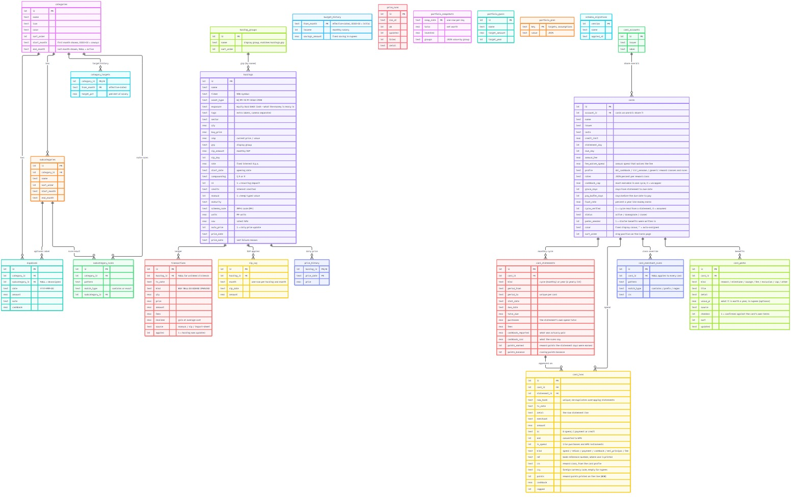

# SpendLens data model

SQLite schema (`spendlens/spendlens_v2.db`). See [README.md](README.md) for the rest of the project.

```mermaid
erDiagram
    categories ||--o{ expenses : "has"
    categories ||--o{ subcategories : "has"
    categories ||--o{ category_targets : "target history"
    categories ||--o{ subcategory_rules : "note rules"
    subcategories ||--o{ expenses : "optional label"
    subcategories ||--o{ subcategory_rules : "rule result"
    holdings ||--o{ transactions : "ledger"
    holdings ||--o{ sip_log : "SIP applied"
    holdings ||--o{ price_history : "daily price"
    holding_groups ||--o{ holdings : "grp (by name)"

    categories {
        int id PK
        text name
        text icon
        text color
        int sort_order
        text start_month "first month shown, 0000-00 = always"
        text end_month "last month shown, NULL = active"
    }
    category_targets {
        int category_id PK,FK
        text from_month PK "effective-dated"
        real target_pct "percent of salary"
    }
    budget_history {
        text from_month PK "effective-dated, 0000-00 = initial"
        int income "monthly salary"
        real savings_amount "fixed saving in rupees"
    }
    subcategories {
        int id PK
        int category_id FK
        text name
        int sort_order
        text start_month
        text end_month
    }
    subcategory_rules {
        int id PK
        int category_id FK
        text pattern
        text match_type "contains or exact"
        int subcategory_id FK
    }
    expenses {
        int id PK
        int category_id FK
        int subcategory_id FK "NULL = Unassigned"
        text date "YYYY-MM-DD"
        real amount
        text note
        real cashback
    }
    holding_groups {
        int id PK
        text name "display group, matches holdings.grp"
        int sort_order
    }
    holdings {
        int id PK
        text name
        text ticker "NSE symbol"
        text asset_type "EQ MF FD PF GOLD CASH"
        text exposure "Equity Gold Debt Cash - what the money is really in"
        text tags "extra labels, comma separated"
        text sector
        real qty
        real buy_price
        real cmp "current price / value"
        text grp "display group"
        real sip_amount "monthly SIP"
        int sip_day
        real rate "fixed interest % p.a."
        text start_date "opening date"
        text compounding "Q A or S"
        int rd "1 = recurring deposit"
        text credits "interest credited"
        int manual "1 = keep typed value"
        text maturity
        text scheme_code "AMFI code (MF)"
        real units "MF units"
        real nav "latest NAV"
        int auto_price "1 = daily price update"
        text price_date
        text price_note "last failure reason"
    }
    transactions {
        int id PK
        int holding_id FK "NULL for unlinked dividends"
        text tx_date
        text kind "BUY SELL DIVIDEND OPENING"
        real qty
        real price
        real amount
        real fees
        real realized "gain at average cost"
        text source "manual / sip / import-sheet"
        int applied "1 = holding was updated"
    }
    sip_log {
        int id PK
        int holding_id FK
        text month "one row per holding and month"
        text sip_date
        real amount
    }
    price_history {
        int holding_id PK,FK
        text price_date PK
        real price
    }
    price_runs {
        int id PK
        text ran_at
        int ok
        int updated
        int failed
        text detail
    }
    portfolio_snapshots {
        text snap_date PK "one row per day"
        real total "net worth"
        real invested
        text groups "JSON value by group"
    }
    portfolio_goals {
        int id PK
        text name
        real target_amount
        int target_year
    }
    portfolio_plan {
        text key PK "targets, assumptions"
        text value "JSON"
    }
    schema_migrations {
        int version PK
        text name
        text applied_at
    }
    card_accounts ||--o{ cards : "share one bill"
    cards ||--o{ card_statements : "monthly cycle"
    cards ||--o{ card_txns : "spend"
    cards ||--o{ card_merchant_rules : "class override"
    cards ||--o{ card_perks : "benefits"
    card_statements ||--o{ card_txns : "appeared on"
    card_accounts {
        int id PK
        text issuer
        text label
    }
    cards {
        int id PK
        int account_id FK "cards on one bill share it"
        text name
        text issuer
        text last4
        real credit_limit
        int statement_day
        int due_day
        real annual_fee
        real fee_waiver_spend "annual spend that waives the fee"
        text profile "sbi_cashback / icici_amazon / generic: reward classes and rules"
        text rates "JSON percent per reward class"
        real cashback_cap "most earnable in one cycle, 0 = uncapped"
        int grace_days "days from statement to due date"
        int pay_buffer_days "days before the due date to pay"
        real float_rate "percent a year idle money earns"
        int cycle_verified "1 = cycle read from a statement, 0 = assumed"
        text status "active / downgrade / closed"
        int perks_seeded "1 = starter benefits were written in"
        text color "fixed display colour, '' = auto-assigned"
        int sort_order "drag position on the Cards page"
    }
    card_statements {
        int id PK
        int card_id FK
        text kind "cycle (monthly) or year (a yearly list)"
        text period_from
        text period_to "unique per card"
        text stmt_date
        text due_date
        real total_due
        real purchases "the statement's own spend total"
        real fees
        real cashback_reported "what was actually paid"
        real cashback_calc "what the rules say"
        int points_earned "reward points the statement says were earned"
        int points_balance "closing points balance"
    }
    card_txns {
        int id PK
        int card_id FK
        int statement_id FK
        text row_hash "unique; de-duplicates overlapping statements"
        text tx_date
        text detail "the raw statement line"
        text merchant
        real amount
        text dc "D spend, C payment or credit"
        int emi "converted to EMI"
        int is_spend "1 for purchases and EMI instalments"
        text kind "spend / refund / payment / cashback / emi_principal / fee"
        text ref "bank reference number, where one is printed"
        text cls "reward class, from the card profile"
        text ccy "foreign currency code, empty for rupees"
        int points "reward points printed on the line (BOB)"
        real cashback
        int capped
    }
    card_merchant_rules {
        int id PK
        int card_id FK "NULL applies to every card"
        text pattern
        text match_type "contains / prefix / regex"
        text cls
    }
    card_perks {
        int id PK
        int card_id FK
        text kind "reward / milestone / lounge / fee / exclusion / cap / other"
        text title
        text detail
        real value_yr "what it is worth a year, in rupees (optional)"
        text source
        int checked "1 = confirmed against the card's own terms"
        int sort
        text updated
    }
```

Notes on the model:
- **Effective dating.** A month uses the latest `category_targets` / `budget_history` row whose `from_month` is on or before that month, so changing a target or salary never rewrites earlier months. Budget cap = `income − savings_amount`.
- **Category lifecycle.** A category is shown in a month if that month is within `start_month`–`end_month` *or* it already has expenses that month, so totals always agree with the data. The same rules apply to sub-categories.
- **Sub-categories** are a reporting label: a category's total always equals the sum of its sub-categories plus *Unassigned*.
- **Portfolio tables.** `holdings` is the current position; `transactions` is the dated history (it may update a holding but deleting a row never reverses it); `sip_log` guarantees a SIP is applied once per month; `portfolio_snapshots` holds one net-worth row per day; `price_history` / `price_runs` log the daily price job; `portfolio_goals` and `portfolio_plan` (key/value JSON) hold goals, target allocation and return assumptions. `holding_groups` is linked to `holdings.grp` by name, not by id.
- **Exposure and tags.** `grp` is where a holding sits (and what targets are set against); `exposure` is one of Equity / Gold / Debt / Cash and is what the money is really invested in, so the exposure shares always add up to 100%. `tags` are optional extra labels (sector, theme) that may overlap; a holding also shows under a group filter named like one of its tags. The target Equity / Gold / Debt ratio, expected returns and time windows live in `portfolio_plan` under `mix_targets`, `mix_returns`, `mix_reach_years` and `mix_years`; Cash counts as Debt there. Older `exposure_targets` are still read as a fallback.
- **Forecasts** are computed on request from `expenses`; nothing is stored (see `plan/spendlens-forecasting-ml-plan.md` for the planned `forecasts` tables).
- **Billing accounts.** A card number and a bill are different things. `card_accounts` groups the cards that share one bill: an ICICI account list names several card numbers, and payments are posted under one yet settle all, so the due date, the payments and the *when to pay* answer belong to the account while spend and rewards belong to the card. Each card number is its own `cards` row. Which numbers are one *physical* card (a re-issue under a new number) is not stored: it is inferred from the dates on every read (`cards.lineage`), so it does not depend on upload order.
- **Credit cards.** `cards` holds the card and its terms; `card_statements` one row per billing cycle, keyed by `period_to`, carrying both the cashback the statement *paid* (`cashback_reported`) and what the rules say it *should* have paid (`cashback_calc`) — the difference is shown on the dashboard rather than hidden. `card_txns` holds the transactions, de-duplicated by `row_hash` so re-importing an overlapping statement adds nothing, with `cls` (a reward class from the card's profile) deciding the rate. `card_merchant_rules` are your corrections to that classification; saving one re-applies the engine to all of history. `kind` separates what was *spent* from what the bank *billed*: net spend is purchases minus refunds plus EMI instalments, while interest, tax and fees are costs, not spend. **Card spend is not written into `expenses`**: the statements cover months that already have hand-entered expenses, so merging them would double count. Linking the two is a later, explicit step.
- **Card perks.** `card_perks` is a card's benefits written down by hand (`spendlens/card_perks.py`): rewards, milestones, lounge access, fees, exclusions and caps, each with an optional yearly value (`value_yr`) and a `source`. A card is seeded once from its scheme's published terms (`cards.perks_seeded` guards the seed) with every row starting unconfirmed (`checked = 0`); after you confirm or edit one it is `checked = 1` and the list is yours. These rows are documentation only — nothing in the reward maths reads them. `cards.color` and `cards.sort_order` are display-only: a fixed colour per card (empty = auto-assigned) and the drag position on the Cards page.
- **Migrations.** `schema_migrations` records which numbered steps from `MIGRATIONS` (`database.py`) have run; each applies once, and a timestamped `.bak` copy is taken before the first pending step on a database that has data. Version 1 is the baseline — the older idempotent `_migrate_admin` / `_migrate_holdings` / sub-category helpers, which still run on every start-up.
- **`user_id`.** Every table with a surrogate `id` carries `user_id INTEGER DEFAULT 1`, added ahead of multi-user support so login does not need a schema rewrite. The key/value and effective-dated-by-month tables (`portfolio_plan`, `budget_history`, `category_targets`, `price_history`) need their primary keys widened instead, which happens with the login work itself.
- A legacy `settings` table exists only so old databases can be migrated into `budget_history`. The unused tables `users`, `rebalance_targets` and `price_alerts` were dropped by migration 2; nothing ever read them.
