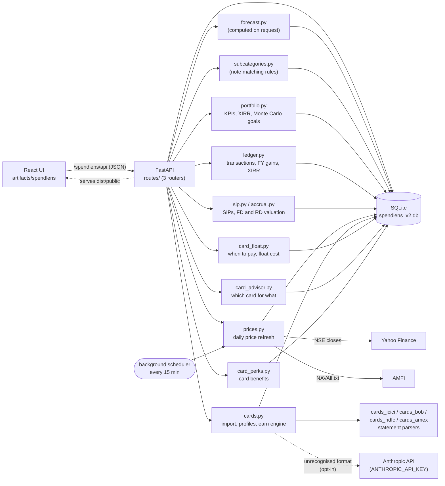
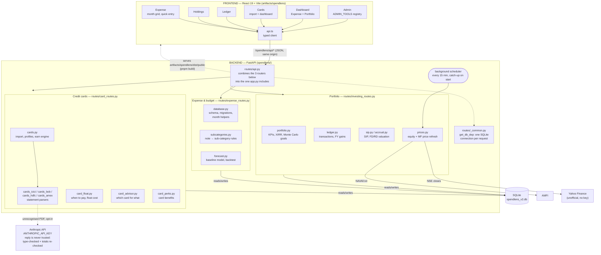

# SpendLens

Personal expense and portfolio tracker (₹, lakh/crore formatting). FastAPI + SQLite backend, React + Vite frontend.

- **Expense** – month grid per category/day with keyboard-first entry, one *Add expense* dialog (single day or a range like `5-12`), sub-categories, month navigation.
- **Holdings** – grouped portfolio (net worth, gain, allocation, insights, sortable by value, invested, gain ₹ or gain %), click a row to edit, CSV export.
- **Ledger** – buys, sells, dividends and opening balances; dividends and realised gain per financial year; XIRR per holding.
- **Dashboard** – Expense dashboard (spend vs budget and pace, projected month-end, where it went with targets and sub-categories, 12-month trend, forecast) and Portfolio dashboard (KPIs, goal odds with a simulated range, allocation vs target, risk, performers, history).
- **Cards** – credit-card cashback dashboard: statement import, what each card earned vs what it could have, merchant breakdown, fee-waiver and utilisation meters, and the spend worth moving. See [CREDIT_CARDS.md](CREDIT_CARDS.md).
- **Admin** – categories, sub-categories, targets and budget, holding groups, goals and target allocation, daily prices.

Where this is going: [ROADMAP.md](ROADMAP.md) (phases, and the redundancies to remove
first), [CREDIT_CARDS.md](CREDIT_CARDS.md) (the planned credit-card profit module) and
[spendlens-forecasting-ml-plan.md](plan/spendlens-forecasting-ml-plan.md) (forecasting / ML, which is Phase 5 of the roadmap).

## Project structure

```
ExpenseTrack/
├── README.md                    this file
├── ROADMAP.md                   product roadmap: phases, redundancy register
├── CREDIT_CARDS.md              planned credit-card profit module
├── plan/                                             forecasting / ML roadmap (Phase A done, B and C planned)
├── package.json                 pnpm workspace scripts (dev, build, typecheck)
├── pnpm-workspace.yaml          workspace + esbuild build-script allowance
├── screenshot/                  source Excel sheet used to import holdings
├── spendlens/                   BACKEND (Python)
│   ├── app.py                   FastAPI app: mounts /spendlens/api, serves the built UI, port 5000
│   ├── database.py              SQLite connection, schema, seeding, migrations,
│   │                            month helpers, categories_for_month, budget_for_month
│   ├── subcategories.py         sub-category seed, note → sub-category matching rules, migration
│   ├── forecast.py              baseline forecasting + backtest (GET /forecast)
│   ├── portfolio.py             portfolio KPIs, snapshots, XIRR, goal Monte Carlo
│   ├── prices.py                daily equity (Yahoo) and MF (AMFI) prices, scheduler
│   ├── ledger.py                transactions, financial-year summary, XIRR per holding
│   ├── sip.py, accrual.py       SIP application, FD/RD auto valuation
│   ├── cards.py                 card import (SBI parser, PARSERS registry, Claude fallback), profiles, earn engine, dashboard
│   ├── cards_icici.py           ICICI Bank statement parser
│   ├── cards_bob.py             Bank of Baroda / BOBCARD statement parser
│   ├── cards_hdfc.py            HDFC Bank (Tata Neu) statement parser
│   ├── cards_amex.py            American Express .xlsx export parser
│   ├── card_float.py            when to pay: billing cycle, payment matching, float cost
│   ├── card_advisor.py          which card for what: best card per spend kind, cost of the wrong one
│   ├── card_perks.py            card benefits (rewards, milestones, lounge, fees) — seed, read, edit
│   ├── requirements.txt
│   ├── routes/
│   │   ├── api.py               aggregates the three routers below into the one FastAPI includes
│   │   ├── _common.py           get_db_dep: the per-request SQLite connection (FastAPI Depends)
│   │   ├── expense_routes.py    categories, budget, sub-categories, expenses, dashboard, forecast
│   │   ├── investing_routes.py  holdings, goals, asset mix, daily prices, transactions, ledger
│   │   └── card_routes.py       cards, statement import, merchant rules, perks, advice
│   └── spendlens_v2.db          the database (your data; back this file up)
└── artifacts/spendlens/         FRONTEND (React 19 + Vite + TypeScript)
    ├── index.html, vite.config.ts (proxy /spendlens/api → :5000), tsconfig.json
    └── src/
        ├── main.tsx, App.tsx    entry and top-bar navigation (Expense / Holdings / Ledger / Cards / Dashboard / ⚙ Admin)
        ├── api.ts               typed API client
        ├── theme.ts, months.ts, index.css
        └── components/
            ├── Expense.tsx          month grid, quick entry, expandable sub-category rows
            ├── ExpenseDialogs.tsx   cell editor (lines) and Add expense dialog
            ├── MonthPicker.tsx      ‹ month, year (years with data) ›
            ├── Dashboard.tsx        Expense + Portfolio dashboards
            ├── Holdings.tsx
            ├── Cards.tsx            credit-card cashback dashboard + statement import
            ├── Ledger.tsx           transactions page
            ├── PortfolioDashboard.tsx  KPIs, goals, allocation, risk, history
            ├── Admin.tsx            Admin shell and tool registry (ADMIN_TOOLS)
            ├── admin/               Categories.tsx, Subcategories.tsx, Targets.tsx, HoldingGroups.tsx, PortfolioPlan.tsx, Prices.tsx
            └── ui.tsx               Card, Modal, Field, Doughnut, buttons, inputs
```

## Architecture



### Detailed architecture

The same system, zoomed in: every page, every endpoint group and every backend module, grouped
into layers so each box only needs the one next to it to make sense.



Reading it top to bottom: the **frontend** is six pages that all go through one typed client
(`api.ts`); every request lands on `routes/api.py`, which is just three domain routers combined
— **Expense & budget**, **Portfolio**, **Credit cards** — each its own file, each a handful of
plain Python modules with one job apiece. Every route gets its database connection the same
way, from the one `get_db_dep` in `routes/_common.py` (a FastAPI `Depends`, so the connection is
always closed on the way out, including when a request fails partway through). Every group reads
and writes the **same single SQLite file**, so there's no second database or cache to keep in
sync. The only two things that leave your machine are the price refresh (Yahoo Finance, AMFI —
both free, no key) and, only if you opt in, an unrecognised card statement going to the Anthropic
API.

## Data model

Tables, relationships and modelling notes are in [DATA_MODEL.md](DATA_MODEL.md).

## Prerequisites

- Python 3.10+
- Node.js 20+ and [pnpm](https://pnpm.io) (`npm i -g pnpm`)

## First-time setup

Run from the project root (the folder containing this README), in PowerShell:

```powershell
# backend
python -m venv venv_expense
.\venv_expense\Scripts\activate
pip install -r spendlens\requirements.txt

# frontend
pnpm install
```

## Run the application

Run everything from the project root (the folder containing this README) in PowerShell. There are two ways to run it; pick one.

### Option A – single server (simplest, everyday use)

The backend serves both the API and the built UI on one port.

```powershell
.\venv_expense\Scripts\activate
pnpm build                # only needed the first time and after frontend changes
python spendlens\app.py
```

Open **http://localhost:5000**. On first start it creates and seeds `spendlens/spendlens_v2.db`. Health check: http://localhost:5000/spendlens/api/healthz should return `{"status":"ok"}`.

### Option B – development (backend + frontend with hot reload)

Use two terminals; both must stay open.

```powershell
# Terminal 1 – backend (API on :5000)
.\venv_expense\Scripts\activate
python spendlens\app.py

# Terminal 2 – frontend (Vite dev server on :3000)
pnpm dev
```

Open **http://localhost:3000**; it proxies `/spendlens/api` to the backend on port 5000. If the backend is not running every page shows `Request failed (500)`.

Notes:
- Run the tests with `pnpm run test` (or `python -m pytest`); `pnpm run check` does
  typecheck + build + tests. See *Tests and migrations* below.
- Restart the backend after any Python change (stop with Ctrl+C, run it again). Frontend changes reload by themselves in Option B; in Option A run `pnpm build` and hard-refresh (Ctrl+F5).
- The backend also runs the daily price refresh in the background, so keep it running (or just open it now and then; missed runs are caught up at start-up).
- `PORT` changes the backend port (`$env:PORT = 5001`), but then update the proxy in `artifacts/spendlens/vite.config.ts`.
- Check types with `pnpm run typecheck`.

URL params: `?page=expense|holdings|ledger|cards|dashboard|admin`, `&tab=portfolio`, `&tool=categories|subcategories|targets|holding-groups|portfolio-plan|prices`.

### Stop the server

Press Ctrl+C in its terminal. If it was started hidden or the terminal is gone, free the port with:

```powershell
Get-NetTCPConnection -LocalPort 5000 -State Listen | ForEach-Object { Stop-Process -Id $_.OwningProcess -Force }
```

## Troubleshooting

- **`Request failed (500)` in the UI** – the backend is not running on port 5000 (the Vite proxy returns 500 when it can't connect). Start it as above. Port 8000 is not used by this app.
- **`Address already in use` / `[Errno 10048]`** – an earlier copy of the backend is still running on port 5000 (often a hidden or forgotten terminal). Stop it with the command under *Stop the server*, then start again.
- **Blank page after `pnpm build`** – rebuild, then restart the backend so it picks up `dist/public`.
- **Missing new data fields or odd behaviour after code changes** – a stale backend is still running; stop it and start it again.

## Tests and migrations

```powershell
.\venv_expense\Scripts\activate
pip install -r spendlens\requirements-dev.txt    # first time only
python -m pytest                                 # or: pnpm run test
```

**The suite never touches your data.** `tests/conftest.py` sets `SPENDLENS_DB` to a
throwaway file before anything is imported, and `database.DB_PATH` honours that
variable (leave it unset for normal use). Tests that need realistic data get a *copy*
of `spendlens_v2.db` and are skipped if the file is not there.

- `tests/test_migrations.py` – the migration chain is applied once, is idempotent, backs
  up first, and does not change your expense data.
- `tests/test_api_shape.py` – every read endpoint answers 200 and still carries the keys
  the UI reads. When a key here changes, `src/api.ts` changes with it.
- `tests/test_mix_math.py` – the SIP-mix engine's invariants: the mix equals the target
  at the reach month, the forecast matches a brute-force loop, no SIP share is ever
  negative, and an unreachable target is reported rather than faked.

**Migrations.** Schema changes are numbered steps in `MIGRATIONS` (`database.py`),
applied once at start-up and recorded in `schema_migrations`. A timestamped
`spendlens_v2.pre-vN-<date>.bak` is written before the first pending step runs on a
database that has data. Version 1 is the baseline: the older "re-check the columns every
start-up" helpers above it (`_migrate_admin`, `_migrate_holdings`, the sub-category
migration) still run as before. To add a step, append `(n, "name", fn)` to the list —
never edit a step that has already shipped.

## Cards (credit cards)

**Admin → Cards** lists every card. Rename a card, or mark it *closed* when you no longer use it: its data is kept in
full (cards are never deleted), it is greyed out, and it leaves pay dates and recommendations. Reopen it any time.
Statements also import from American Express `.xlsx` exports and HDFC Tata Neu PDFs.

**Benefits** are written down per card (Admin → Cards → Benefits, and on each card's page): rewards, milestones, lounge,
fees, exclusions and caps, each with an optional yearly value and where it came from. A card starts from its scheme's
published terms, every entry marked *to check* until you confirm it; after that the list is yours. They are
documentation, not inputs: nothing in the reward maths reads them. **Edit details** changes a card's name, bank, digits,
network, notes, scheme, limit, fees and cycle. Every card has a fixed colour (its `slot`, by id) used on every screen.

**Which card for what** (Cards overview) shows the best card per kind of spend and what the wrong card cost over 12
months. Rates are the issuers' published terms in `card_advisor.py` (marked assumed or measured where they are not
published); point values (Rs 0.25 a point, Rs 1 a NeuCoin) are assumptions. Caps, milestones, lounges and fees are not
in the rates. A merchant correction on a card replaces the earlier one for that merchant.

Open **Cards** in the top bar. **All cards** is the usage view: total and last-12-month spend,
fees and interest, one tile per card (period of use, spend, EMI share, fees, top merchant, and
whether the card is still in use), spend by financial year split by card, and every bill's pay
date in one list. One pill per card opens that card.

**Import.** *Import statements* takes one or more PDFs, from any mix of cards. The password
is used for that one request and is never stored, and the PDF is not kept, only the parsed
rows. Each statement names its own card (issuer plus last digits) and the card is created
from it the first time, so there is no card to pick.

**Which statements can be read.** There is no general-purpose PDF parser; each bank layout
needs its own reader, registered in `PARSERS` in `spendlens/cards.py` as a detector plus a
parser. Today: **SBI Card** (monthly cycle statements, `cards.py`), **ICICI Bank** (`cards_icici.py`, yearly
account transaction lists), **Bank of Baroda / BOBCARD** (`cards_bob.py`, monthly statements in two
PDF layouts), **HDFC Bank** (`cards_hdfc.py`, Tata Neu PDF statements) and **American Express**
(`cards_amex.py`, `.xlsx` exports). Anything else is reported as unrecognised rather than guessed at.

**One file, several cards; one bill, several cards.** An ICICI list is per *account*: it has a
section for each card number and an account-level section for items like reward-redemption fees
(which go to the card in use on that date). Cards listed on one statement share a bill, so they
are put on one **billing account**. Payments are posted under one card yet settle the whole bill,
so the *when to pay* maths takes every card on the account, while spend stays per card. Editing
the billing cycle applies to every card on the bill, because they share one due date.

**Re-issued cards.** A bank re-issues a card under a new number. A number that starts within 120
days after another stops, on the same bill and without overlapping it, is treated as that
card's replacement; two numbers used at the same time are two cards. This is an *inference* from
the dates, recomputed on every read (so it does not depend on upload order), and the page lists
every number of a card so a wrong grouping is visible. Unknown ICICI cards start as *usage only*:
no reward scheme is assumed. Edit a card to name it and to pick a scheme (Amazon Pay ICICI, SBI
Cashback), which resets its rates to that scheme's published ones.

**How a file is checked.** SBI and BOB print their totals (BOB: opening balance, payments, new purchases,
closing balance), so the parsed transactions must add up to them. ICICI's yearly list prints no totals at all, so the check is
*coverage*: every date-led line must parse, or the file is rejected whole. Either way a file
is imported completely or not at all, and re-uploading is safe: every row has a hash, and two
genuinely identical lines on one day each keep their own.

**Claude fallback (optional, off by default).** For a format with no reader, set
`ANTHROPIC_API_KEY` in the backend's environment and restart; the dialog then offers *Use
Claude for formats without a built-in reader*. The statement's text is sent to Anthropic, so
it is opt-in per upload. Claude's reply is never trusted: fields are type-checked, `is_spend`
is derived locally, and the transactions must add up to the statement's own purchases total
or the whole file is rejected. A statement a built-in reader recognises never goes to Claude.
The key is read from the environment and never stored.

**When to pay.** The top panel works out the best day to pay each card's bill. A card lends
you the money free from the day you spend until the bill's due date, so paying the day the bill
arrives, or paying as you go, hands that float back. Paying *after* the due date costs a fee
plus roughly 45% a year on the whole cycle. So the pay date is the due date minus a safety
margin (default 1 day), stepped back off a weekend. It needs a **billing cycle**: a statement
day and the days to the due date. SBI prints both, so they are read and marked *verified*;
ICICI's yearly list prints neither, so its cycle is inferred and marked *assumed* until you
confirm it from a monthly statement (Edit). The panel also shows how you actually pay: the days
of free credit you use against what was available, how early you pay, and what that costs a
year at the rate your idle money earns (a setting, default 7%; it is the savings or liquid-fund
rate, not what the card charges). Payments are matched to spends oldest first, so each rupee
paid is tied to the spend it settled. The logic is in `spendlens/card_float.py`, as pure
functions of dates and amounts.

**Rewards.** The SBI statement prints the cashback it paid, so the page shows it beside what
the rules compute; the gap is the measure of how well the rules fit, and choosing a merchant's
kind corrects it (saved as a rule, re-applied to all history). The ICICI list prints no reward,
so it is *estimated* from the card's rates and labelled as such. Refunds take their reward
back. Rates are per card and editable (Edit), since 5% on Amazon needs Prime and is 3% without.

Card spend is stored in `card_txns`, deliberately **not** merged into `expenses`: statements
cover months that already have hand-entered expenses, so merging would double count. See
[CREDIT_CARDS.md](CREDIT_CARDS.md) for the model, what the real statements showed, and what is
still to build.

## Expense page shortcuts

Click a cell, then just type an amount (Enter saves, Tab saves and moves right, Esc cancels). Enter on a selected cell opens the detail editor (sub-category, note, several lines); Del clears a single-entry cell; arrow keys move the selection; **N** opens *Add expense*; **[** and **]** change the month. The add dialog remembers your last category and sub-category.

## Expense dashboard

- **Spent** – spend against the budget cap, with a marker for where you should be today and an on-pace / ahead / under chip. Cashback is shown in the sub-line.
- **Left to spend** – cap minus spend, with an amount per remaining day (current month). Past months show *Left unspent* / *Overspent*.
- **Projected month-end** – current month only, from the forecast model with a likely range. Past months show **vs other months**: the two previous months and the following month.
- **Savings rate** – actual saving rate against the planned one.
- **Where it went** – ranked categories, over-target first, with a target tick and ₹ over/under; click a row for its sub-categories.
- **Pace** – cumulative spend vs the budget line, last month as a faint line, forecast as a dotted line with a range.
- **12 months** – spend bars with the budget cap per month; click a bar to open that month.
- **Worth a look** and **Largest expenses** – automatic notes and the month's top five entries.
- **Forecast card** (current month) – next month's total, range and top categories, with the backtest error.

## Forecasting (`spendlens/forecast.py`, `GET /forecast?month=`)

Baseline model, no ML library. Per category: median of the last 6 months with data, nudged 30% towards the same month last year; steady items (e.g. rent) use their latest amount. The range is the 10th–90th percentile of those months. For the current month, spend so far is blended with the run rate. A 12-month backtest (each month predicted from earlier data only) is compared with "same as last month"; the dashboard shows both errors and marks categories as *low confidence* when the model does not beat that baseline. It needs at least 3 months of earlier data. Roadmap (lumpy annual payments, real ML models, stored forecasts): `plan/spendlens-forecasting-ml-plan.md`.

## Admin tools

Open **Admin** in the top bar; tools are listed in a left-hand menu. New tools are added in the `ADMIN_TOOLS` list in `artifacts/spendlens/src/components/Admin.tsx`.

**Categories** – add, edit, reorder, archive, restore, delete. History is never rewritten:
- A new category starts in the chosen month (default: current); earlier months never show it.
- *Archive* hides a category from a chosen month onward (default: **next month**, so the current month stays complete). It stays, with all amounts, in every earlier month and can be restored.
- A month that already contains entries for a category always shows it, so totals can't disagree with the data.
- *Delete* is only offered for categories that never had an expense.
- Name / icon / colour are labels and change in every month; no amounts change.

**Sub-categories** – each category can be split (e.g. Transport → Fuel, Cab & Auto, Parking). Pick one per entry in the cell editor (select a day and press Enter, or double-click it; add several lines per day) or in *Add expense*. Expand a category row (▶) to see its sub-categories per day. Sub-categories follow the same rules as categories (start month, archive from a month, restore, delete only if unused), are for reporting only (targets stay at category level), and feed the dashboard's "Where it went" detail. Existing entries were mapped automatically from their notes; the *Needs review* tab lists the rest, and mapping a note applies to every entry with that note and is remembered. Unmapped entries show as "Unassigned", so category totals never change.

**Targets & Budget** – you enter *total salary* and *total saving* (₹); the *budget cap* is salary − saving and is editable too (editing it changes saving). Category targets are % of salary, accept decimals, and can be edited as % or ₹/month (the other updates). Their sum is the *expense target*; expense target + saving must equal 100% of salary and Save is blocked above that. Saving stays fixed: a *Balancing category* (default Miscellaneous, changeable or off) absorbs any change you make to another target, the salary or the saving, so the total stays at 100%. Everything is *effective-dated*: a change applies from the month you pick, and earlier months keep the values they had. Salary can differ per month (add a row from that month); the change history is shown on the same page.

When an older database is upgraded, the app first copies it next to the original (`spendlens_v2.pre-admin.bak`, `spendlens_v2.pre-subcat.bak`). These are created only once, during that migration, and can be deleted afterwards.

## Notes

- The Holdings page groups rows by `grp`, managed in Admin → Holding groups (add, rename, delete; deleting moves holdings to the built-in Others bucket, empty `grp`), shows monthly SIPs and flags FDs that mature within 90 days. Click a row to edit; Delete is inside the edit dialog.
- **Fixed-rate holdings.** Tick *Manual value* to switch auto-calculation off and keep the present value you type. *Credited yearly* mode is for cumulative FDs: value = principal + the interest credits you enter (date, amount per line) with later yearly credits projected at the rate; no interest is shown between credit dates. Give a holding an interest rate, opening date and (optionally) closing date and its present value is computed on every read: invested amount grown at the rate (quarterly, annual or simple), each SIP growing from its own date, frozen at the closing date. Nothing is stored, so changing the rate or dates takes effect at once. Tick *Recurring deposit* for an RD: it then uses one deposit of the SIP amount per month from the opening date (each earning interest from its own date) and invested becomes the sum of those deposits.
- **Edit holding: auto-calculation and auto deposit.** There is no setting literally called "auto deposit"; the *Recurring deposit* checkbox does it (Invested then shows *Auto (deposits)*). What the form does depends on interest rate + opening date, *Manual value*, *Recurring deposit* and *Monthly SIP* (`Holdings.tsx`, `spendlens/accrual.py`):

  | Rate + opening date | Manual value | Recurring deposit | Monthly SIP | Invested | Present value | Behaviour |
  |---|---|---|---|---|---|---|
  | Missing (either) | any | any | any | typed | typed | No auto-calculation; the form hints to add a rate and opening date. |
  | Both set | ticked | any | any | typed | typed | Auto-calculation off; typed values kept. |
  | Both set | off | off | 0 | typed | **auto** | Invested grows at the rate from the opening date. |
  | Both set | off | off | > 0 | typed | **auto** | Opening principal grows from the opening date; each SIP the app applies on the SIP day grows from its own date. |
  | Both set | off | on | 0 | typed | **auto** | Same as the row above with SIP 0: Recurring deposit does nothing without a SIP amount. |
  | Both set | off | **on** | **> 0** | **Auto (deposits)** | **auto** | **Auto-deposit mode.** One deposit of the SIP amount on the opening date, then one on the SIP day of each following month; each earns interest from its own date. Invested = SIP × number of deposits. |

  Other fields: the *closing date* stops deposits and growth and freezes the present value there. *Compounding* is Quarterly, Annual, Simple or Credited yearly; *Credited yearly* (cumulative FD) and its credits box apply only when Recurring deposit is off (with it on, the value compounds quarterly). *SIP day* blank uses the opening date's day; short months use their last day. Use Recurring deposit for a bank RD or any fixed monthly deposit; leave it off for an FD or PF where you enter the invested amount.
- **Exposure and tags.** Every holding has a *group* (where it sits, e.g. Mutual Funds), one *exposure* (Equity / Gold / Debt / Cash: what it is really invested in) and optional *tags* (sector or theme). Exposure is filled in automatically: EQ → Equity; GOLD or any fund with "gold" in the name → Gold; FD and PF → Debt; CASH → Cash; funds from their name (cap / ELSS / flexi → Equity, arbitrage and debt funds → Debt, liquid → Cash). For the mix calculations Cash counts as Debt, so there are three exposures. The holding dialog has an Exposure box (Auto keeps the current value) and a Tags box. Tags start from the old Sector label (stocks, funds) and *Emergency* for the emergency fund; classification now lives in tags, the *Sector* column is kept only as *Institution / purpose* (bank or goal, mainly for FDs and PFs) and the Portfolio dashboard's "Equity by sector" uses each stock's first tag. The **Dashboard → Asset Mix** tab shows allocation by exposure (donut and table with gain and drift from target), exposure by group, and a themes / sectors breakdown (`GET /portfolio/exposure`).
- **SIP mix plan (Asset Mix tab).** Set a target Equity / Gold / Debt ratio, expected yearly returns, a "reach within N years" window and a forecast length in Admin → Goals & targets (`PUT /portfolio/mix-plan`, stored in `portfolio_plan` as `mix_targets`, `mix_returns`, `mix_reach_years`, `mix_years`). `GET /portfolio/mix` returns today's SIP split by exposure, a forecast, and the SIP split that reaches the target. Only where new SIPs go changes; nothing is sold. For each month N it solves for the constant SIP shares that put the mix on target at month N (an exposure already above target would need a negative SIP and is held at 0); the first N that works is the earliest possible date, and the split for your chosen window (a gentler change) is the one suggested, switching to the target ratio afterwards. The forecast is one deterministic path at the expected returns, with SIPs stepping up by the yearly rise set in the same admin page.
- **SIPs.** Set an amount and day per holding (Admin → Holding groups → expand a group, or the holding dialog). On that day the amount is added to the holding's invested and present value (units added at the current price for stocks and gold). It runs when the data is read, so missed months are caught up; each application is logged (`sip_log`) and never applied twice. Manual edits are never recalculated.
- **Portfolio dashboard.** KPIs come from `GET /portfolio/kpis` (`spendlens/portfolio.py`): net worth, gain, XIRR, yearly investing, emergency cover (months of average spend), allocation versus target by group with the amount to add or trim, concentration, sector split, fixed-income yield, best and worst holdings. A value snapshot is stored daily in `portfolio_snapshots` when the app is opened; the 30-day change, history curve and XIRR build from those (XIRR needs 60 days). Goals (`portfolio_goals`), target allocation and return assumptions (`portfolio_plan`) are edited in Admin → Goals & targets. The goal projection is a Monte Carlo simulation, not a trained model: each group grows at its own return and volatility, current SIPs continue and step up yearly, goals are paid out in their year, and the P10/P50/P90 range and per-goal funding odds come from 1,500 paths (plus a lower-returns case). The emergency fund is excluded from goal money.
- **Daily prices** (`spendlens/prices.py`, Admin → Prices). Holdings with *Auto* ticked are updated by a background thread that checks every 15 minutes and runs after 19:00 and 22:30 on weekdays, and straight after start-up if a run was missed (so the app only needs to be open at some point). Equity: NSE symbol in `holdings.ticker`, last close and 52-week high/low from Yahoo Finance's chart endpoint (unofficial, no key). Mutual funds: AMFI scheme code and `units`, value = units × NAV from AMFI's `NAVAll.txt`; MFs stay one line (qty 1, cmp = value) and SIPs buy units at that day's NAV. *Auto-map* suggests symbols (kept only if the live price is within 35% of the stored one) and Direct-Growth scheme codes; *= value → units* fixes the units from today's value. A failed source leaves the old value and shows the reason; every run is logged in `price_runs`, daily prices in `price_history`, and a portfolio snapshot is saved after each run. Gold and fixed-return holdings are not fetched.
- **Ledger** (`spendlens/ledger.py`, Ledger page). Buys, sells, dividends and opening balances in `transactions` (holding, date, qty, price, amount, fees, realised gain). Buy/Sell can also update the holding (priced holdings: quantity and average cost; funds/FDs: invested and value, MF units at NAV); untick that to record an old trade only. SIPs add a BUY row automatically. Deleting a row never changes the holding. Realised gain uses average cost, not lots, so it is a guide rather than a tax statement. The summary shows dividends and realised P&L per financial year (April–March) and XIRR per holding and overall from dated flows; FDs and RDs with an opening date are included automatically, other holdings need an *Opening* entry (the date the money went in). The Portfolio dashboard uses the ledger XIRR once at least half the portfolio is covered, otherwise the snapshot XIRR. 150 dividend rows were imported once from the DIVIDEND sheet (`source = import-sheet`).
- Holdings of type MF / FD / PF are entered as invested + present value (stored as quantity 1 × amounts); EQ / GOLD / CASH use quantity × price.
- Data lives only in `spendlens/spendlens_v2.db`; copy that file to back it up.

**Reward schemes.** A card's *scheme* (Edit) decides how rewards are worked out. *Amazon Pay ICICI*, *ICICI
Rubyx* and *ICICI Sapphiro* estimate points from the bank's published rates (Rubyx and Sapphiro: 4 points per
Rs 100 international, 2 domestic, 1 on utilities and insurance, none on fuel; a point valued at Rs 0.25, which the
bank's page does not state, so it is an assumption). Rubyx and Sapphiro also get a **benefits panel**: the yearly
milestone (Rubyx 3,000 points at Rs 3L and 1,500 per further lakh to 15,000; Sapphiro 4,000 at Rs 4L and 2,000 per
lakh to 20,000), lounge quarters, and what redeeming costs (Rs 99 plus GST each). *BOB Eterna* needs no estimate:
its statements print the points per transaction and in total, so rewards are read, and only the rupee value of a
point (Rs 0.25) is assumed. A product is never guessed from a folder name or a number series: the ICICI statements
do not name it, so you set it.

**Missing statements.** If a monthly statement is missing from a run (say August between July and September),
the cycle that would have shown that month's payments is unseen. Pay timing is therefore worked out within each
unbroken run of statements, never across the gap, so a missing month cannot appear as a late payment; the page
names the missing statement.
